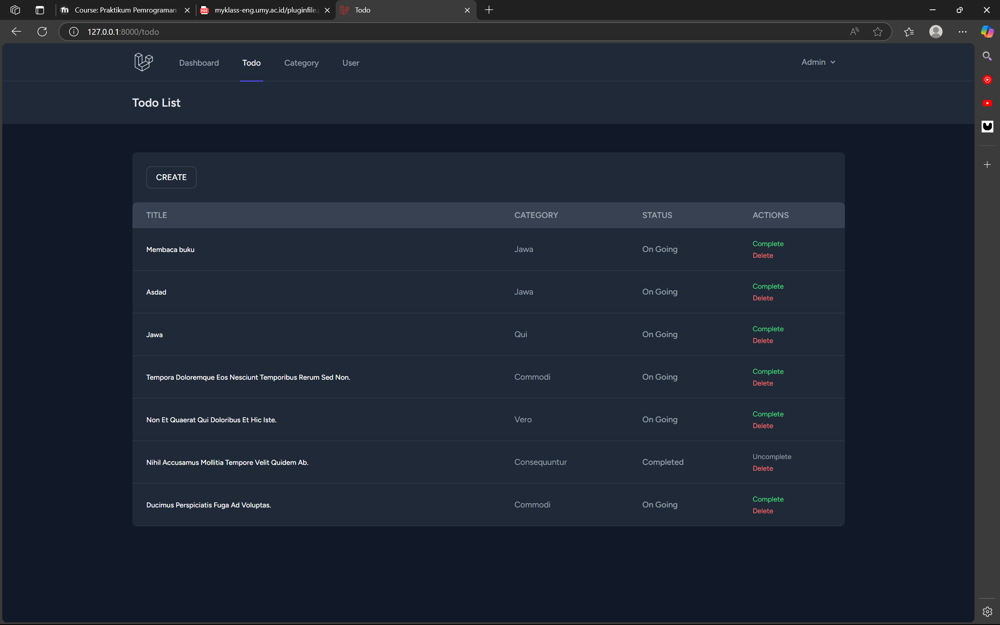
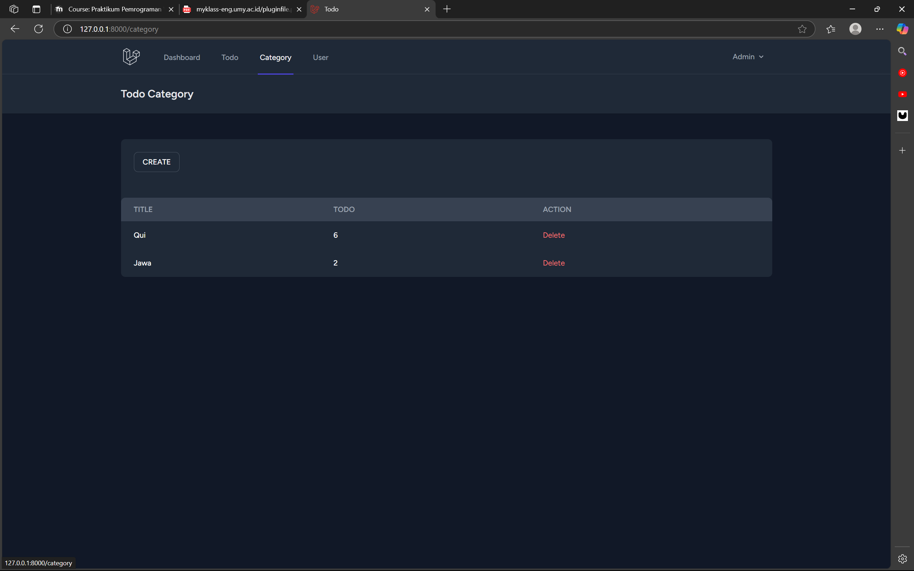
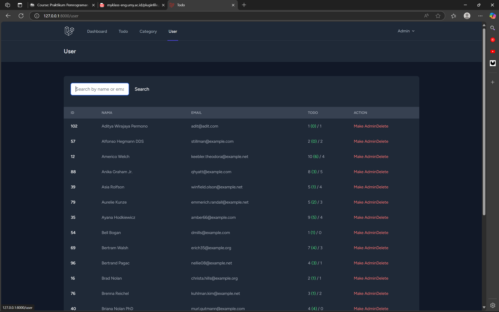
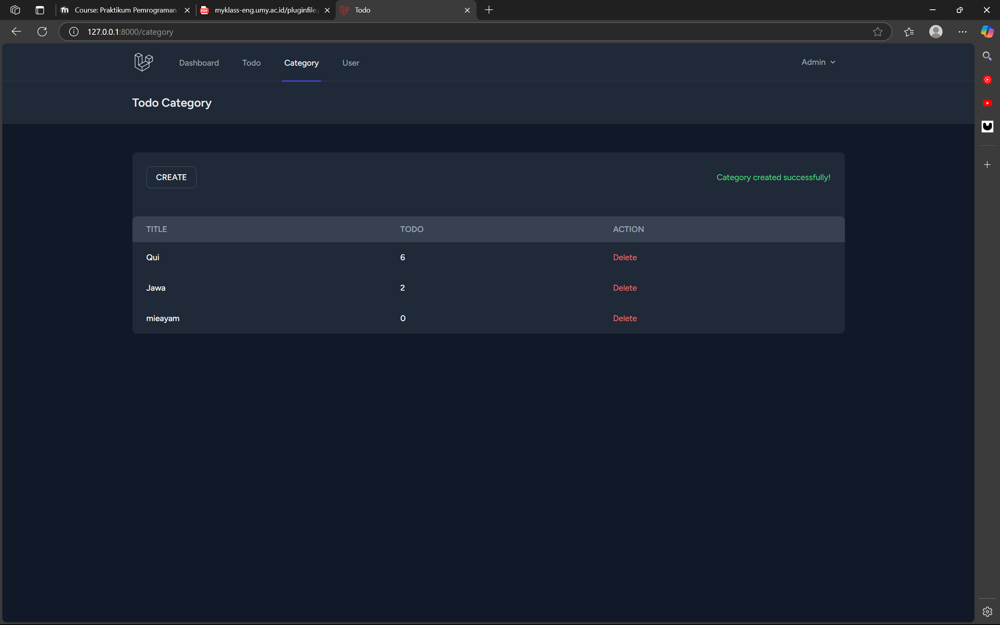
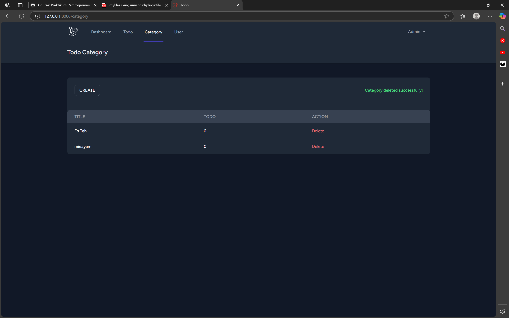
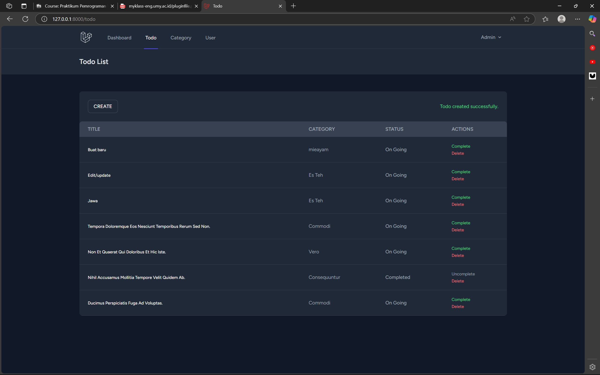

# UCP 1

## 1. Todo List

## 2. Category List

## 3. User List

## 4. Create Category

## 5. Update/Edit Category

## 6. Delete Category

## 7. Create Todo with category

## 8. update/edit/Select Category todo
